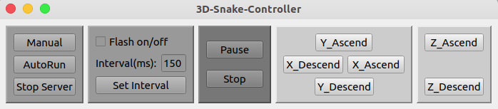
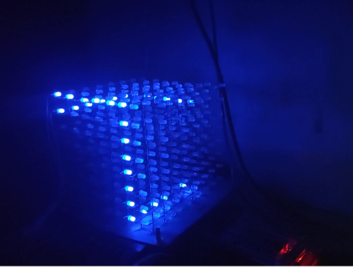

## 3D 贪吃蛇

> 树莓派 + 光立方

光立方驱动及特效代码： [Leopard-C/LedCube](https://github.com/Leopard-C/LedCube)

### 控制方式:

+ 人工控制： 通过HTTP请求控制。（用Qt写了个客户端，按键绑定如下）

    + WADS: 控制XY平面的移动
    + JK: 控制Z轴上的移动
    + P: 暂停 / 继续
    + T: 结束游戏

    

+ AI自动寻路:

    

### 演示视频

[BV1av411i7Go](https://www.bilibili.com/video/BV1av411i7Go)
